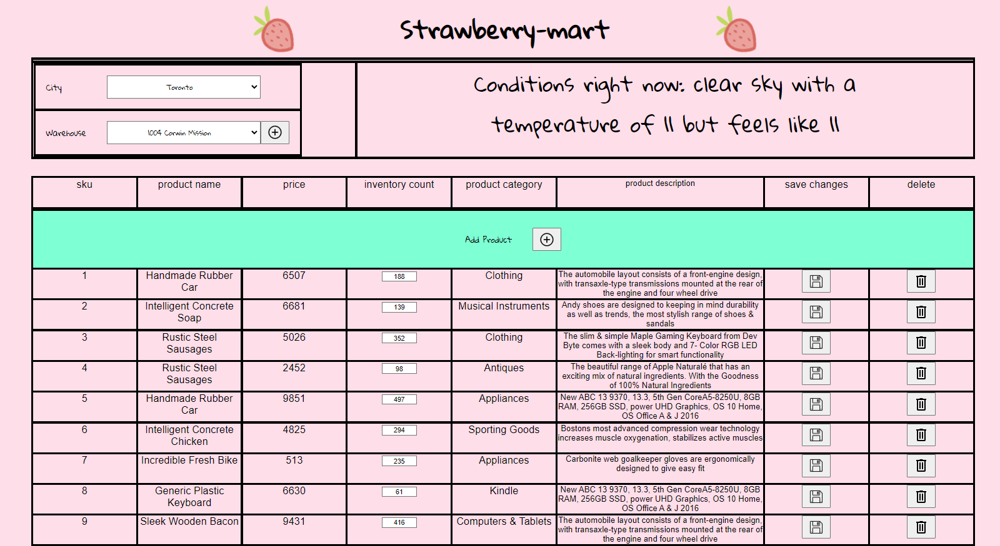
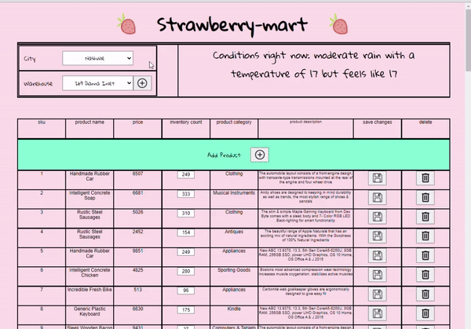
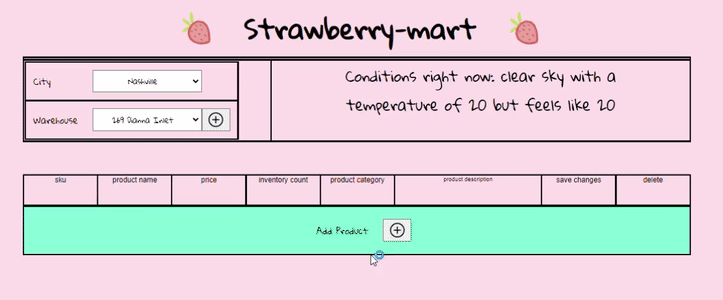
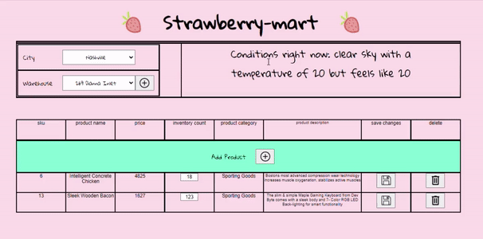
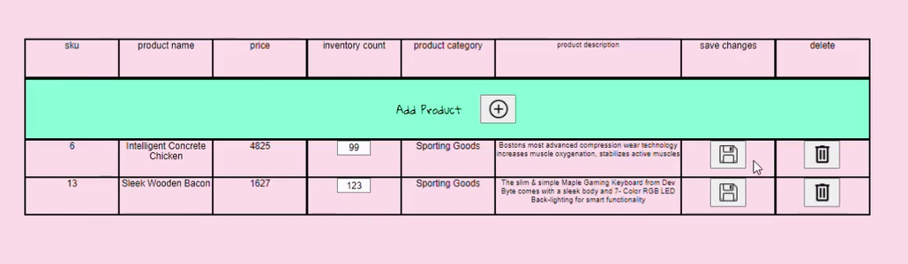

### Demo: https://crud-inventory-system.cassandrapeters.repl.co/

## Table Of Contents
[Documentation](#Documentation)
    ↳ [About](#About)
    ↳ [How To Run](#Setup)
    ↳ [To Do](#To-Do)
   
[Images](#Images)

[STACK](#Stack)
    [SERVER_SIDE](#Server_side)
        ↳ [Graphql](#Express)
        ↳ [Express.js](#Sequelize)
        ↳ [MySQL](#MySQL)
        ↳ [Sequelize](#MySQL)
        ↳ [Join Monster](#MySQL)
    [CLIENT_SIDE](#Client_Side)
      ↳ [React](#Express)       

# Documentation

## About
This project is a full-stack application. The front end is made using React. The backend is a REST API that uses GraphQL, Express.js, Sequelize, MySql, Join-Monster, and a few other tools. SQL was chosen in due to its proven ability to be a robust solution for inventory management applications. That being said, SQL is not easily horitontally scalable and so it has trade-offs. 

## Setup
- set up a .env file
- Cd client && npm install
- Cd Server && npm install 
- Cd Crud-Inventory-System npm install
- npm run 

## TO DO: 
- Create configurable dev, stage, and prod enviroments
- Create tests for sequalize database seeds
- Clean up unsightly react code
- Make GraphQL handle communication with the Open Weather API instead of Express.js doing so 

## STACK

### GraphQL
An admitatdly rough implementation of GraphQL used to mediate inbound queries. GraphQL offered an easy to implement solution for defining API routes thanks to the simplicity of defining  and  roots. Join-monster was used to help accomidate flexible queries and rapidly produce SQL queries that could fulfil requests made to the GraphQL endpoint. 

### Express
*Express.js* is the server used to build the backend.

### MySQL 
The SQL database is populated by the the SEQUALIZE models defined in the [Sequelize/models](/Server/Sequelize/models) folder. The current database model is focused on creating an effecient relational model that scales well while proving consistent.

UML Diagram Database was built using

### Sequelize 
The relational SQL database is populated by the the SEQUALIZE models defined in the [/models](/App/Backend/app/models) folder. We focused on creating an effecient relational model using good design principles that minimize table redundency and NULL values.

### Join Monster
Used to assist in creating dynamic sql queries based on GraphQL query parameters

# Images

## Adding a warehouse

## Adding inventory to a warehouse location

## Updating inventory

## Editing inventory

## Deleting inventory

